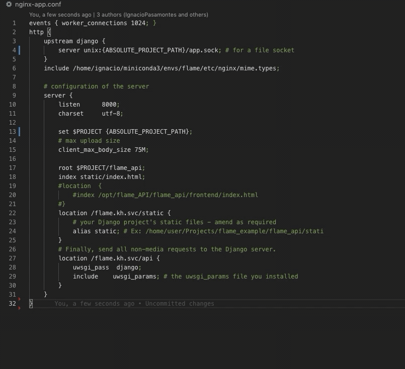
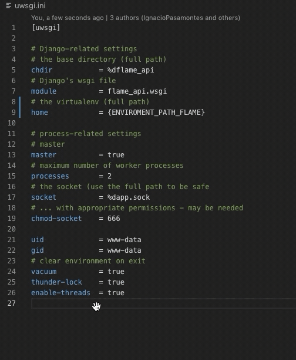
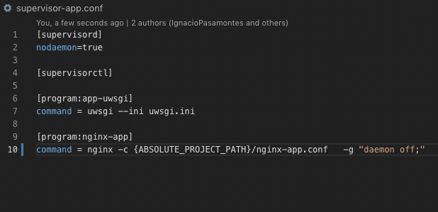

# flame_API
OpenAPI 3 definition for flame and django rest framework implementation.

## Installation

Flame should have been already installed in this computer. Refer to the [flame](https://github.com/phi-grib/flame) manual for full instructions of how create a flame conda environment and install the software. 

Start activating the flame environment typing:

```bash
source activate flame (in Linux)
activate flame (in Windows)
```

Download the repository:

```bash
git clone https://github.com/phi-grib/flame_API.git
```

Go to the source repository directory 

```bash
cd flame_API/flame_api
```
Configure:






Type

```
python manage.py runserver
```

Then, open a browser and type the address http://localhost:8000

## Flame GUI
The flame GUI consist in 2 main areas: control area and visualization area.

Control area has all functions needed. Those functions are distributed in three tabs (Manage, Build and Predict). The Manage tab is responsible for managing the models: create, delete, import and export. Build and Predict tabs are teh responsible to create and predict models. In both tabs, the sequence is always the same:

- First we have to select a model
- Next step is select a training or prediction set
- Select the parameters desired in case of construction.
- And finally, throw the prediction or build the model.


## Screenshots

Areas:


## flame API design explanation
Here I'll use the base URL to be `api.flame.edu/v1/` as a placeholder for the future (no yet created) base URL that respects the consortium specs.

For sake of simplicity and guiven the architecture of flame this API uses 3 roots:

```
/manage
/build
/predict
```

Each model is a *resource* that the client can create, modify, delete or exploit so the url structure will be:

```
api.flame.edu/v1/{root}/models/{modelname}
```

Over this resource the client can create, delete or get info with the HTTP verbs (POST, DELETE, GET...).

----
<!---
## TODO

* Control errors **[Status_codes](https://www.django-rest-framework.org/api-guide/status-codes/)** for responses
* Use data **[validators](https://www.django-rest-framework.org/api-guide/validators/)** for requests and responses
* Write **[serializers](https://www.django-rest-framework.org/api-guide/serializers/)** to send and receive standardized data
* Review response schemas in `flameAPI.yml`

-----
## Docs

https://www.django-rest-framework.org/

[Serializer tutorial](https://www.django-rest-framework.org/tutorial/1-serialization/)
-->
